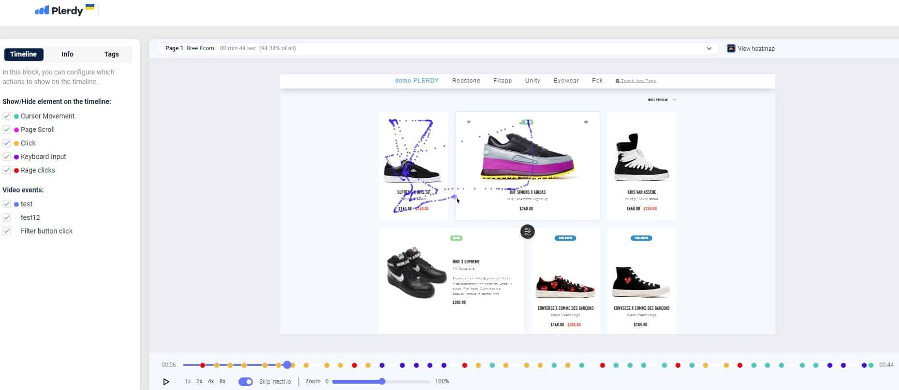

# Introduction to Digital Marketing

## Targeting 101

---

# What is Digital Marketing

Digital marketing refers to the use of various online channels, platforms, and strategies to promote products, services, or messages to a target audience. It encompasses a wide range of activities aimed at reaching and engaging people through the internet and electronic devices. Digital marketing leverages the power of technology and the internet to connect with potential customers, build brand awareness, drive traffic, and ultimately achieve specific business goals.

There are multiple techniques and skills used by digital marketers to produce

---

# Typical Components of Digital Marketing

**Search Engine Optimization (SEO):** Optimizing websites and online content to rank higher in search engine results, making it easier for potential customers to find relevant information.

**Social Media Marketing:** Using social media platforms like Facebook, Instagram, Twitter, and LinkedIn to connect with audiences, share content, and build a brand's online presence.

**Content Marketing:** Creating and distributing valuable and relevant content such as articles, videos, infographics, and podcasts to attract and engage target audiences.

---

# Typical Components of Digital Marketing... 2

**Email Marketing:** Sending targeted emails to subscribers or potential customers to deliver personalized content, promotions, and updates.

**Pay-Per-Click Advertising (PPC):** Placing ads on search engines or other websites, and paying only when a user clicks on the ad, directing them to the advertiser's website.

**Affiliate Marketing:** Partnering with other individuals or businesses (affiliates) to promote your products or services, and paying them a commission for each sale or action generated through their efforts.

---

# Typical Components of Digital Marketing... 3

**Influencer Marketing:** Collaborating with individuals who have a significant online following (influencers) to promote products or services to their audience.

**Online Public Relations (PR):** Managing a brand's online reputation, handling crises, and maintaining a positive public image through various digital channels.

**Analytics and Data Analysis:** Collecting and analyzing data on user behavior, website traffic, conversion rates, and other metrics to refine marketing strategies and improve outcomes.

---

# Typical Components of Digital Marketing... 4

**Mobile Marketing:** Optimizing marketing efforts for mobile devices, considering the prevalence of smartphones and tablets among consumers.

**Video Marketing:** Creating and sharing videos online to engage audiences, tell stories, and showcase products or services.

**Chatbots and AI:** Utilizing artificial intelligence and chatbots to provide instant customer support and engagement on websites and messaging platforms.

---

# Targeting in Digital Marketing

Digital marketing targeting refers to the process of selecting and focusing on specific segments of an audience that are most likely to be interested in your products, services, or messages. Instead of trying to reach a broad and general audience, targeting allows you to direct your marketing efforts towards individuals or groups who are more likely to engage with and respond positively to your marketing campaigns. This approach helps you use your resources more effectively and generate better results.

---

Digital marketing targeting is crucial because it allows you to deliver personalized and relevant content to the right people at the right time, increasing the chances of conversions and engagement. It minimizes wastage of resources on audiences that are unlikely to be interested in what you're offering. Through data analysis and insights, you can refine and adjust your targeting strategies over time to optimize your campaigns for better performance and higher return on investment.

---

# Information Significant to Digital Marketers

**Demographics:** This includes characteristics like age, gender, location, marital status, education level, and more. Demographic targeting helps you tailor your messages to the preferences and interests of specific groups.

**Psychographics:** Psychographic factors include values, beliefs, lifestyle, interests, and personality traits. This type of targeting helps you create content that resonates with the emotional and psychological aspects of your audience.

**Behavioral Data:** Targeting based on user behavior involves analyzing data such as previous online interactions, purchase history, website visits, and clicks. This helps you predict user preferences and customize your marketing efforts accordingly.

---

# Information Significant to Digital Marketers... 2

**Interests and Hobbies:** Identifying the interests and hobbies of your target audience allows you to create content that aligns with their passions and increases the likelihood of engagement.

**Contextual Targeting:** Placing ads or content in contexts that are relevant to your offerings. For example, showing ads for running shoes on websites or articles related to fitness and running.

**Device and Platform:** Targeting specific devices (desktop, mobile, tablet) or platforms (social media, search engines, apps) can help you optimize your content for different user experiences.

---

# Information Significant to Digital Marketers... 3

## Signature Targeting

**Remarketing/Retargeting:** Targeting users who have previously interacted with your website or content but didn't complete a desired action, such as making a purchase. This aims to re-engage them and encourage them to convert.

**Lookalike Audiences:** Creating new audience segments that share similarities with your existing customers or subscribers. This helps you find new potential customers who are likely to be interested in your offerings.

*Note:* ***Signature targeting*** *is not a common term in digital marketing*

---

# Enabling Web Properties to Collect Targeting Data

## Practice Demonstrations

---

# Example 1

## Search for "hotjar" and discuss capabilities

---

# Reading 1

## [What Is Mouse Movement Tracker](https://www.plerdy.com/blog/mouse-movement-tracker/)

---

# Reading 2

[A Study on Mouse Movement Features to Identify User](http://dx.doi.org/10.31364/SCIRJ/v8.i4.2020.P0420766)

Masud Karim & Md. Hasanuzzaman

